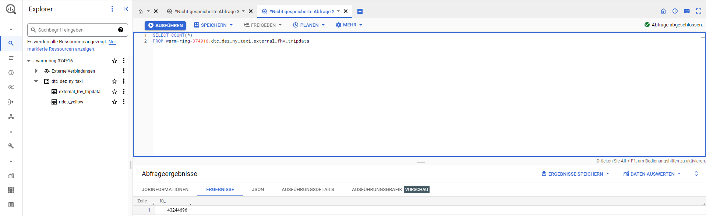
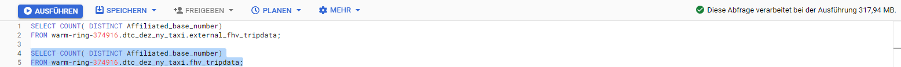
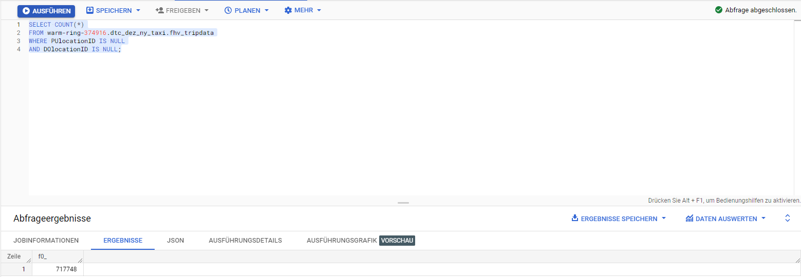
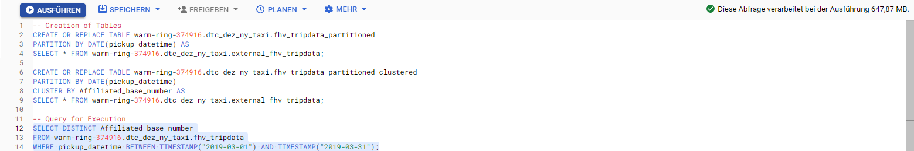
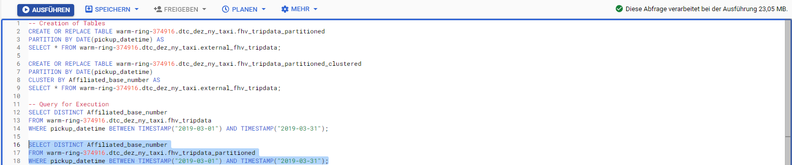
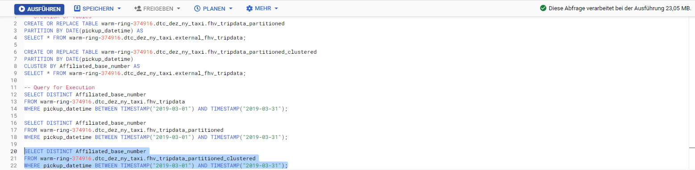

## Week 3 Homework
<b><u>Important Note:</b></u> 
You can load the data however you would like, but keep the files in .GZ Format. 
If you are using orchestration such as Airflow or Prefect do not load the data into Big Query using the orchestrator.  
Stop with loading the files into a bucket.   
<u>NOTE:</u> You can use the CSV option for the GZ files when creating an External Table 

<b>SETUP:</b> 
Create an external table using the fhv 2019 data.  
Create a table in BQ using the fhv 2019 data (do not partition or cluster this table).  
Data can be found here: https://github.com/DataTalksClub/nyc-tlc-data/releases/tag/fhv 

## Question 1:
What is the count for fhv vehicle records for year 2019?
- 65,623,481
- 43,244,696
- 22,978,333
- 13,942,414

## Answer 1.
The number of records for the fhv trip data in the year 2019 is `43,244,696`.  

## Question 2:
Write a query to count the distinct number of affiliated_base_number for the entire dataset on both the tables.  
What is the estimated amount of data that will be read when this query is executed on the External Table and the Table?

- 25.2 MB for the External Table and 100.87MB for the BQ Table
- 225.82 MB for the External Table and 47.60MB for the BQ Table
- 0 MB for the External Table and 0MB for the BQ Table
- 0 MB for the External Table and 317.94MB for the BQ Table 

## Answer 2.

`0 MB for the External Table and 317.94MB for the BQ Table` </bq>

External Table:

BQ Table:

## Question 3:
How many records have both a blank (null) PUlocationID and DOlocationID in the entire dataset?
- 717,748
- 1,215,687
- 5
- 20,332

## Answer 3.
The number of records that have a blank PUlocationID and DOlocationID is `717,748`. </bq>

## Question 4:
What is the best strategy to optimize the table if query always filter by pickup_datetime and order by affiliated_base_number?
- Cluster on pickup_datetime Cluster on affiliated_base_number
- Partition by pickup_datetime Cluster on affiliated_base_number
- Partition by pickup_datetime Partition by affiliated_base_number
- Partition by affiliated_base_number Cluster on pickup_datetime

## Answer 4.
As the slides say, the best strategy to optimize the table is `Partition by pickup_datetime and Cluster on affiliated_base_number`. The filtering should be executed on partitioned data as the amount of lines that are handled can be drastically reduced. The clustering itself is ordering the data content in a maner which benefits the ORDER BY operator and increases speed as well as decreases the costs of the query.

## Question 5:
Implement the optimized solution you chose for question 4. Write a query to retrieve the distinct affiliated_base_number between pickup_datetime 2019/03/01 and 2019/03/31 (inclusive).  
Use the BQ table you created earlier in your from clause and note the estimated bytes. Now change the table in the from clause to the partitioned table you created for question 4 and note the estimated bytes processed. What are these values? Choose the answer which most closely matches.
- 12.82 MB for non-partitioned table and 647.87 MB for the partitioned table
- 647.87 MB for non-partitioned table and 23.06 MB for the partitioned table
- 582.63 MB for non-partitioned table and 0 MB for the partitioned table
- 646.25 MB for non-partitioned table and 646.25 MB for the partitioned table

## Answer 5.
The estymated bytes processed by BigQuery are `647.87 MB for non-partitioned table and 23.06 MB for the partitioned table`.  
Non-Partitioned Data Table:

Partitioned Data Table:

Partitioned and Clustered Data Table:

## Question 6: 
Where is the data stored in the External Table you created?

- Big Query
- GCP Bucket
- Container Registry
- Big Table

## Answer 6.
The data itself is stored in the `GCP Bucket` of an external table.

## Question 7:
It is best practice in Big Query to always cluster your data:
- True
- False

## Answer 7.
It is `False` that you should always cluster your data. Table with data size < 1 GB, don’t show significant improvement with partitioning and clustering.
Furthermore, the cost benefit is unknown as compared to partitioning. A more granular aproach is required in comparison to partitioning. The benefit of clustering over partitioning can only be seen with common use of filters or aggregation against multiple particular columns.

## (Not required) Question 8:
A better format to store these files may be parquet. Create a data pipeline to download the gzip files and convert them into parquet. Upload the files to your GCP Bucket and create an External and BQ Table. 

Note: Column types for all files used in an External Table must have the same datatype. While an External Table may be created and shown in the side panel in Big Query, this will need to be validated by running a count query on the External Table to check if any errors occur. 
 
## Submitting the solutions

* Form for submitting: https://forms.gle/rLdvQW2igsAT73HTA
* You can submit your homework multiple times. In this case, only the last submission will be used. 

Deadline: 13 February (Monday), 22:00 CET

## Solution

We will publish the solution here
